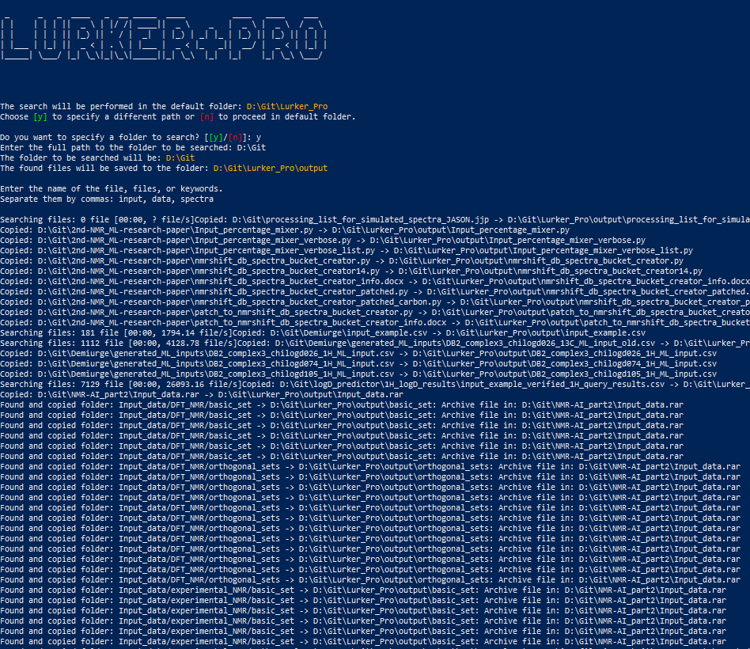

# Lurker PRO

**Lurker PRO** is a powerful Python script designed to recursively search through directories, including the contents of ZIP and RAR archives, for specific files or folders based on user-provided keywords. It offers a simple, user-friendly command-line interface for conducting comprehensive file searches. The search results are saved in a specified output directory.



## Features
- **Recursive Directory Search**: The script traverses all subdirectories starting from a user-defined or default directory.
- **Keyword-based Search**: Search is based on user-supplied keywords or file names. Multiple keywords can be used to refine the search.
- **Archive Support**: The script can search inside ZIP and RAR archives for matching file or folder names.
- **Progress Tracking**: The script displays a progress bar during the search to indicate how many files have been checked.
- **Customizable Output Directory**: All found files are copied to a designated output folder.
- **Error Handling**: The script includes extensive error handling for smoother execution.
- **ASCII Art**: A welcome screen with a stylized ASCII logo adds a nice visual touch.

## Installation

### Prerequisites
Before running the script, ensure that Python 3.x is installed on your system.

### Installing Required Modules
This repository includes an installation script, `Install_modules.py`, that ensures all required modules are installed. The modules include:

- `tqdm`: For displaying progress bars.
- `zipfile`: For handling ZIP files (part of the standard library).
- `rarfile`: For handling RAR files.
- `art`: For generating ASCII art for the welcome screen.

To install the necessary modules, run the following command:
```bash
python Install_modules.py
```

The script will automatically check if the required modules are installed. If any are missing, it will install them using `pip`.

#### Manual Installation
If you prefer to install the modules manually, use the following command:
```bash
pip install tqdm rarfile art
```

## Usage

### Running the Lurker_PRO_v3 Script
To start the script, use the following command:
```bash
python Lurker_PRO_v3.py
```

### Input Parameters

1. **Folder to Search**:
   - The script states that the search will be executed in the default directory where the script was run.
   - It then asks if the user wants to select a directory to search other than the default one.
   - If you choose "yes" (`y`), you can specify a different folder path to be searched.
   
2. **Keywords**:
   - The script will prompt you to enter one or more keywords to search for. Separate multiple keywords with commas.
   
3. **Output Directory**:
   - The script creates an output directory (`output` by default) where all found files are copied.
   
### Example

```bash
python Lurker_PRO_v3.py
```
- The script starts by displaying a welcome ASCII art logo.
- It then asks whether you want to search the default directory or specify your own.
- After providing the directory path, it prompts you to enter search keywords.
- The script then searches the directory and archives for files matching the provided keywords.
- Matching files are copied to the output directory.

### Output
All files matching the search criteria are copied to the output directory. If files are found inside ZIP or RAR archives, they are extracted and copied to the output folder as well.

### Error Handling
- If any module is missing, the script will raise an ImportError and terminate. Be sure to run the `Install_modules.py` script beforehand.
- If a directory or file cannot be found, the script provides an error message without crashing.

### Termination
Once the search is completed, the script waits for the user to press "Enter" before finishing.

## Folder Structure

```
- root_directory/
  - Lurker_PRO_v3.py
  - Install_modules.py
  - output/               # This is where the found files are saved
```

## Customization

You can modify the script for more complex searches or integrations. The search mechanism is based on regex patterns, so the regular expression can be adapted to match specific file types, file names, or folder names.

### Default Directory
By default, the script searches in the directory in which it runs by function os.getcwd(). You can change this path in the script or provide a different path during execution.

## License

This project is licensed under the MIT License.
